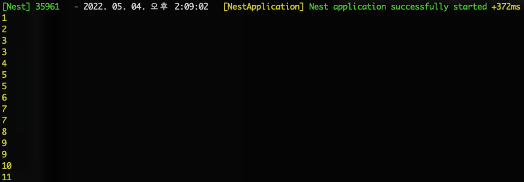
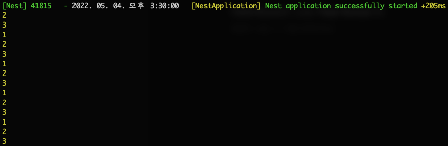

## 어떤 상황에서 멀티 인스턴스 사용할까?

Node.js는 싱글 쓰레드 환경에서 구동되며, 그렇기에 NestJS 는 싱글톤 인스턴스의 사용을 지향하고 있습니다. 싱글톤 인스턴스는 전체 애플리케이션에 공유되는데, 여기서 공유한다는 것은 인스턴스를 캐시할 수도 있고 초기화가 애플리케이션 시작 중에 한번만 발생하므로 메모리와 동작 성능을 향상 시킬 수 있습니다.

하지만 멀티 인스턴스가 필요한 경우가 있습니다.
SQS 에서 다수의 메시지를 동시에 폴링해서 크롤링을 해야하는 경우 싱글톤 인스턴스가 쿠키를 공유해서 데이터가 섞이는 문제가 발생했습니다. 기존에 문제가 발생하던 CrawlerService 클래스는 아래와 같습니다.

```typescript
import { Injectable } from '@nestjs/common';
import tough from 'tough-cookie';
import axios from 'axios';

@Injectable()
export class CrawlerService {
  private cookieJar = new tough.CookieJar(); // cookieJar 공유

  async crawlingData() {
    try {
      const response = await axios.get('https://www.bznav.com/', {
        headers: {
          cookie: this.cookieJar,
          connection: 'keep-alive'
        },
        jar: this.cookieJar,
        withCredentials: true
      });

      return {
        headers: response.headers,
        data: response.data
      }
    } catch (err) {
      throw err;
    }
  }
}
```

## 멀티 인스턴스 적용하기
NestJS 에서는 싱글톤 인스턴스 문제를 REQUEST 스코프 데코레이터를 활용해서 해결할 수 있습니다.
REQUEST 스코프는 들어오는 요청마다 인스턴스가 생성되며, 요청에 대한 응답처리가 완료되면, 인스턴스가 garbage-collected 처리 됩니다. (동일한 요청에 대해서는 동일한 인스턴스가 공유)

실제로 REQUEST 스코프가 적용되기 전과 후를 비교해볼 필요가 있었습니다.

### REQUEST 스코프 적용 전
sleep 을 주고 multiInstanceCount 가 1 부터 최대 3 까지 올라가도록 작성했습니다.
여기서 sleep 은 multiInstanceCount 가 어떻게 동작하는지 조금 더 명확하게 확인하고자 추가 되었습니다.

```typescript
import { Injectable } from '@nestjs/common';

@Injectable()
export class MultiInstanceService {
	multiInstanceCount: number;

	constructor() {
		this.multiInstanceCount = 1;
	}

	/** 타이머 */
	sleep(ms) {
    return new Promise((resolve) => setTimeout(resolve, ms));
  }

  /** 멀티 인스턴스 메소드 */
	async multiInstance() {
    try {
      console.log(this.multiInstanceCount);

      await this.sleep(3000);

      this.multiInstanceCount = this.multiInstanceCount + 1;
      console.log(this.multiInstanceCount);

      await this.sleep(5000);

      this.multiInstanceCount = this.multiInstanceCount + 1;
      console.log(this.multiInstanceCount);

      return true;
    } catch (err) {
      throw err;
    }
  }
}
```

이제 SQS 에 다수의 메시지를 보내고 동시에 MultiInstanceService 클래스가 폴링하게 작업을 하였습니다. 그 결과는 아래 이미지와 같았습니다.



만약 multiInstanceCount 변수를 공유하지 않았다면 최대 3 을 넘으면 안되지만, 실제로 공유되어 값이 누산 되는 것을 확인 했습니다.


### REQUEST 스코프 적용 후
```typescript
import { Injectable } from '@nestjs/common';

@Injectable({ scope: Scope.REQUEST }) // REQUEST 스코프 적용
export class MultiInstanceService {
	multiInstanceCount: number;

	constructor() {
            this.multiInstanceCount = 1;
	}

	/** 타이머 */
	sleep(ms) {
            return new Promise((resolve) => setTimeout(resolve, ms));
  }

  /** 멀티 인스턴스 메소드 */
	async multiInstance() {
    try {
      console.log(this.multiInstanceCount);

      await this.sleep(3000);

      this.multiInstanceCount = this.multiInstanceCount + 1;
      console.log(this.multiInstanceCount);

      await this.sleep(5000);

      this.multiInstanceCount = this.multiInstanceCount + 1;
      console.log(this.multiInstanceCount);

      return true;
    } catch (err) {
      throw err;
    }
  }
}
```

REQUSET 스코프 추가 전과 마찬가지로 테스트 하였고, 아래 이미지 처럼 multiInstanceCount 값이 최대 3 을 초과하지 않는 것으로 확인했습니다. 이를 통해 REQUEST 스코프를 추가함으로 싱글 인스턴스 문제를 해결이 된다는 것을 확인 하였습니다.
여기서 특이한 점은 REQUSET 스코프 추가된 클래스를 참조하는 상위 클래스는 모두 REQUSET 스코프 추가 된 것처럼 멀티 인스턴스가 생성됩니다.



## 정리하기
NestJS 에서 멀티 인스턴스를 구현하기 위해 단 한줄만 추가해주면 됩니다.

```typescript
@Injectable({ scope: Scope.REQUEST })
```
